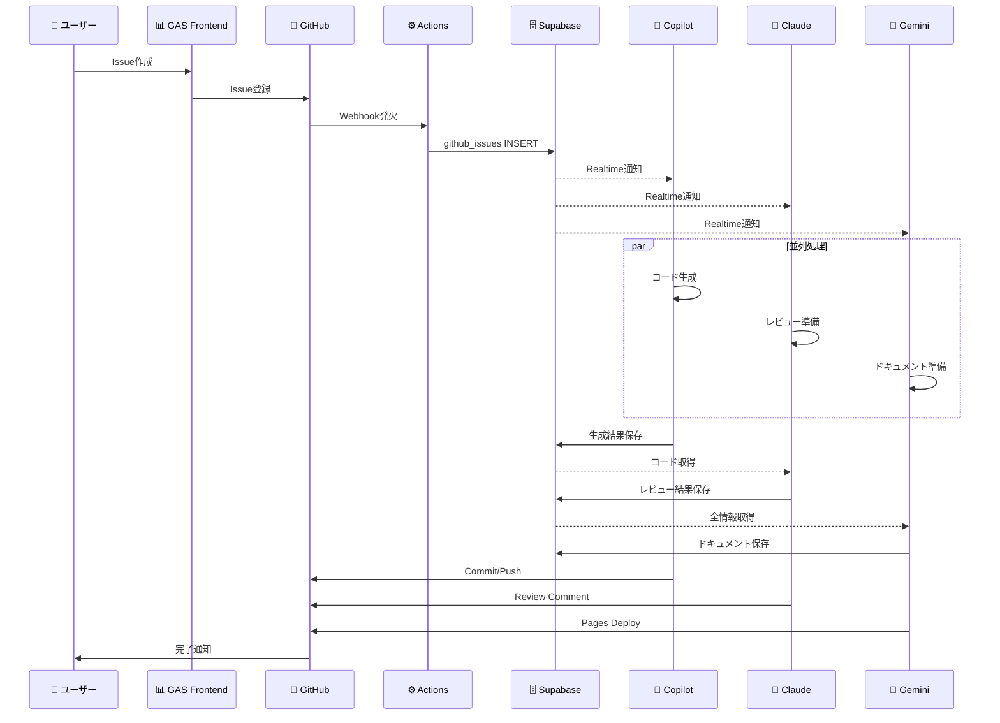
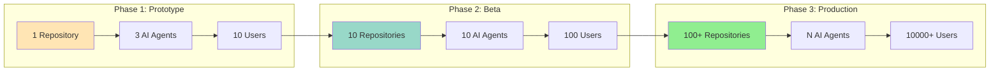
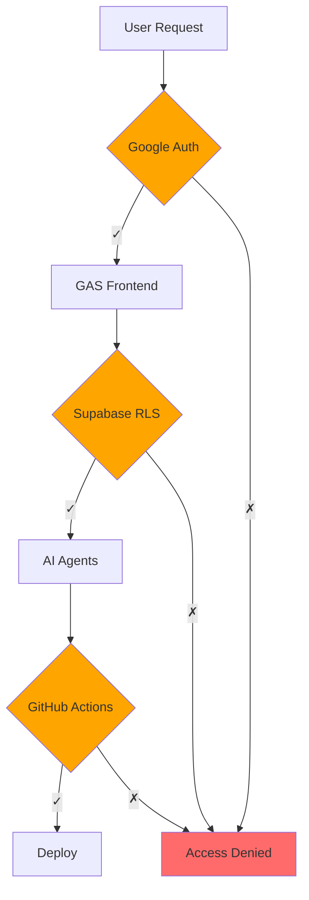
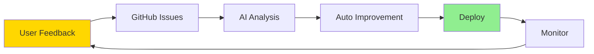

# AI Automation Platform - 全体アーキテクチャ

## 🌍 グローバル分散AI協働システム

```mermaid
graph TB
    subgraph "🌐 Global Access Layer (Frontend)"
        GAS[Google Apps Script<br/>Clasp管理<br/>$0 コスト]
        SHEET[Google Spreadsheet<br/>Service Registry]
        GAS <--> SHEET
    end
    
    subgraph "🔄 AI Collaboration Hub"
        SUPABASE[Supabase PostgreSQL<br/>+ Realtime]
        
        subgraph "Database Tables"
            ISSUES[(github_issues)]
            RESPONSES[(ai_responses)]
            AGENTS[(ai_agent_state)]
            HEALTH[(health_checks)]
        end
        
        SUPABASE --> ISSUES
        SUPABASE --> RESPONSES
        SUPABASE --> AGENTS
        SUPABASE --> HEALTH
    end
    
    subgraph "🤖 AI Agent Ecosystem"
        AI1[VS Code Copilot<br/>コード生成]
        AI2[Claude API<br/>レビュー・分析]
        AI3[Gemini API<br/>ドキュメント作成]
        AI4[Custom Agents<br/>拡張可能]
    end
    
    subgraph "⚙️ Automation Pipeline"
        ACTIONS[GitHub Actions<br/>sync-issues.yml]
        PYTHON[Python Scripts<br/>health_check.py]
        WEBHOOK[Webhooks<br/>自動トリガー]
    end
    
    subgraph "📦 Output & Distribution"
        GITHUB[GitHub Repository<br/>Issues/PR/Pages]
        DOCS[GitHub Pages<br/>ドキュメント]
        API[REST API<br/>外部連携]
    end
    
    %% データフロー
    GAS -->|Issue作成| ACTIONS
    SHEET -->|Service管理| PYTHON
    
    ACTIONS -->|Webhook| SUPABASE
    PYTHON -->|Health Check| SUPABASE
    
    SUPABASE <-->|Realtime| AI1
    SUPABASE <-->|Realtime| AI2
    SUPABASE <-->|Realtime| AI3
    SUPABASE <-->|Realtime| AI4
    
    AI1 -->|Commit/Push| GITHUB
    AI2 -->|Review Comment| GITHUB
    AI3 -->|Documentation| DOCS
    
    GITHUB -->|Realtime反映| SUPABASE
    DOCS -->|Public Access| GAS
    
    %% 外部連携
    API -->|JSON/REST| SUPABASE
    WEBHOOK -->|Trigger| ACTIONS
    
    style GAS fill:#34A853
    style SUPABASE fill:#3ECF8E
    style AI1 fill:#0078D4
    style AI2 fill:#8B5CF6
    style AI3 fill:#4285F4
    style GITHUB fill:#181717
```

## 🎯 システムの特徴

### 1. ゼロコスト グローバルアクセス
- **Frontend**: Google Apps Script (Clasp)
  - サーバー不要
  - Google認証で世界中からアクセス
  - メンテナンスコスト $0

### 2. Realtime AI協働
- **Hub**: Supabase PostgreSQL + Realtime
  - 複数AIが同時並行作業
  - 状態をリアルタイム共有
  - RLSによるセキュリティ

### 3. Git的な分散協調
- **Output**: GitHub (Issues/PR/Pages)
  - バージョン管理
  - Pull Request レビュー
  - 全世界公開

### 4. 拡張可能なエコシステム
- **Agents**: プラグイン可能
  - 新しいAIサービスを追加
  - カスタムエージェント開発
  - API経由で連携

## 📊 データフロー

## 🔧 技術スタック

| Layer | Technology | Cost |
|-------|------------|------|
| Frontend | Google Apps Script (Clasp) | $0 |
| Database | Supabase PostgreSQL | $0 (Free tier) |
| Realtime | Supabase Realtime | $0 (Free tier) |
| AI-1 | VS Code Copilot | 含む (VS Code) |
| AI-2 | Claude API | 従量課金 |
| AI-3 | Gemini API | $0 (Free tier) |
| Automation | GitHub Actions | $0 (2000分/月) |
| Hosting | GitHub Pages | $0 |
| **Total** | **初期コスト** | **$0** |

## 🚀 スケーラビリティ

## 🌍 グローバル展開戦略

### 地理的スケーリング
- **Supabase**: Multi-region対応
- **GitHub Pages**: CloudFlare CDN
- **GAS**: Google Global Infrastructure

### 言語対応
- **UI**: GAS で多言語切り替え
- **AI Output**: 自動翻訳（Gemini）
- **Documentation**: GitHub Pages 多言語版

## 🔐 セキュリティ

### セキュリティレイヤー
1. **Google認証**: OAuth 2.0
2. **Supabase RLS**: Row Level Security
3. **GitHub Secrets**: トークン管理
4. **API Key**: 環境変数で管理

## 📈 パフォーマンス

| メトリクス | 目標 | 現状 |
|-----------|------|------|
| Issue → AI応答 | < 30秒 | 実装中 |
| Realtime遅延 | < 1秒 | 実装中 |
| 同時ユーザー | 100+ | 設計中 |
| AI並列処理 | 10 Agents | 3 Agents |

## 🔄 継続的改善

---

**Document Version**: 1.0  
**Last Updated**: 2026-02-28  
**Author**: AI Automation Platform Team
