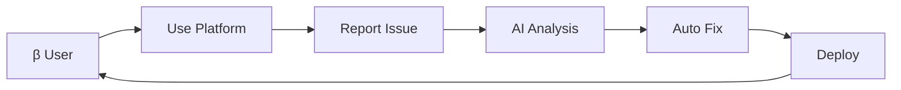
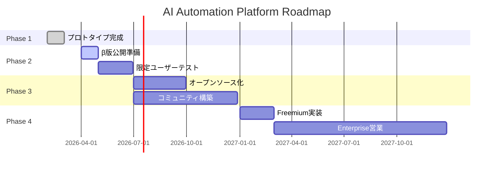

# AI Automation Platform - ビジネスプラン

## 🎯 ビジョン

**「AIをGitのように、誰でも使えるインフラへ」**

世界中の誰もが、無料でAIエージェントを活用できるプラットフォームを構築し、  
人間とAIの協働を民主化する。

---

## 📋 Executive Summary

### プロジェクト概要
- **名称**: AI Automation Platform
- **目的**: AIエージェントの分散協調システム構築
- **特徴**: $0スタート、グローバルアクセス、オープンソース
- **市場**: 全世界の開発者・企業・教育機関

### ビジネスモデル
1. **Phase 1-2**: 完全無料（オープンソース）
2. **Phase 3**: Freemium モデル
3. **Phase 4**: Enterprise プラン

---

## 🚀 Phase 1: プロトタイプ完成 (完了間近)

**期間**: 2026年2月 - 2026年3月  
**目標**: 基本機能の実装とテスト

### ✅ 完了済み
- [x] Supabase インフラ構築
  - github_issues, ai_responses, ai_agent_state テーブル
  - RLS ポリシー設定
  - Realtime 有効化

- [x] GitHub 連携
  - ai-automation-dashboard (kenichimiyata)
  - ai-automation-docs (kenichimiyata)
  - ai-automation-platform (bpmbox)
  - GitHub Projects #6, #8

- [x] ドキュメント整備
  - README.md
  - System Architecture
  - GitHub Pages 公開

- [x] GAS Frontend (Clasp管理)
  - spreadsheet-project
  - 11種類の統合ツール
  - Service Registry (t-lounge)

### 🔄 進行中
- [ ] GitHub Actions Workflow
  - sync-issues.yml 実装
  - Webhook 設定
  - エラーハンドリング

- [ ] Copilot Bridge
  - Realtime Listener
  - pyautogui 自動化
  - メッセージフォーマット

- [ ] Health Monitoring
  - service_health_check.py 実行
  - 11サービス監視
  - Issue 自動作成

### 成果物
- **動作するプロトタイプ**
- **技術ドキュメント完備**
- **GitHub Pages デモサイト**

---

## 🌱 Phase 2: β版公開 (2026年4月〜6月)

**期間**: 3ヶ月  
**目標**: 限定ユーザーでの実証実験

### 実施内容

#### 2.1 Clasp によるオープンソース展開
```bash
# 既存のClaspプロジェクトを公開
cd localProject/clasp/spreadsheet-project
clasp deploy --description "AI Automation Platform Beta"
```

**公開内容:**
- GAS Frontend コード (MIT License)
- Service Registry テンプレート
- セットアップガイド
- API リファレンス

#### 2.2 β版ユーザー募集
**Target**: 50-100 ユーザー

**募集方法:**
1. GitHub で Issue テンプレート作成
2. Twitter/LinkedIn で告知
3. 開発者コミュニティに投稿
   - Reddit (r/programming, r/automation)
   - Hacker News
   - Dev.to

**参加条件:**
- GitHubアカウント所持
- Googleアカウント所持
- フィードバック協力

#### 2.3 機能拡張
- [ ] AI Agent 追加 (5種類以上)
  - ChatGPT API 連携
  - Anthropic Claude 連携
  - Google Gemini 連携
  - Hugging Face Models
  - Custom Agent SDK

- [ ] ダッシュボード強化
  - リアルタイム監視UI
  - AI実行ログ表示
  - エラーアラート

- [ ] ドキュメント多言語化
  - 英語版 (必須)
  - 日本語版
  - 中国語版

#### 2.4 フィードバック収集


### KPI (Key Performance Indicators)
| 指標 | 目標 |
|------|------|
| β ユーザー数 | 50-100人 |
| 稼働率 | 95%以上 |
| Issue解決時間 | 平均24時間以内 |
| ユーザー満足度 | 4.0/5.0以上 |

### コスト試算
| 項目 | 月額 |
|------|------|
| Supabase (Free Tier) | $0 |
| GitHub (Free) | $0 |
| GAS (Free) | $0 |
| AI API (従量課金) | $50-200 |
| **合計** | **$50-200** |

---

## 🌍 Phase 3: オープンソース化 (2026年7月〜12月)

**期間**: 6ヶ月  
**目標**: グローバルコミュニティ形成

### 3.1 オープンソースリリース

**GitHub Organization作成:**
```
https://github.com/ai-automation-platform
```

**リポジトリ構成:**
```
ai-automation-platform/
├── core/                 # コアシステム
├── agents/              # AIエージェント集
├── frontend-gas/        # GAS Frontend
├── docs/                # ドキュメント
├── examples/            # サンプルプロジェクト
├── sdk/                 # 開発者SDK
└── community/           # コミュニティ
```

**ライセンス:**
- コア: MIT License
- ドキュメント: CC BY 4.0
- サンプル: Unlicense

### 3.2 Clasp パッケージ公開

**npm パッケージ化:**
```bash
npm init @ai-automation-platform/gas-frontend
npm publish
```

**インストール:**
```bash
npm install -g @ai-automation-platform/cli
ai-platform init my-project
ai-platform deploy
```

### 3.3 コミュニティ構築

**プラットフォーム:**
- GitHub Discussions (議論)
- Discord Server (リアルタイムチャット)
- YouTube Channel (チュートリアル)
- Medium Blog (技術記事)

**コントリビューター募集:**
- Good First Issue ラベル
- Hacktoberfest 参加
- Contributor Guide 作成

**イベント開催:**
- オンラインハッカソン (月1回)
- AI Agent Contest (四半期)
- Annual Conference (年1回)

### 3.4 エコシステム拡大

**パートナーシップ:**
- AI企業: OpenAI, Anthropic, Google
- インフラ: Supabase, Vercel, Cloudflare
- 教育機関: 大学・専門学校

**マーケットプレイス:**
```
https://marketplace.ai-automation-platform.org
```
- カスタムエージェント販売
- テンプレート配布
- アドオン提供

### KPI
| 指標 | 目標 |
|------|------|
| GitHub Stars | 1,000+ |
| Contributors | 50+ |
| デプロイ数 | 500+ |
| 月間アクティブユーザー | 1,000+ |

### 収益化準備
- [ ] Freemium モデル設計
  - Free: 基本機能
  - Pro: 高度な機能 ($9/月)
  - Team: チーム機能 ($49/月)
  - Enterprise: 専用サポート (要相談)

---

## 💼 Phase 4: ビジネス展開 (2027年〜)

**期間**: 継続的  
**目標**: 持続可能なビジネスモデル確立

### 4.1 Freemium モデル実装

#### Free Tier (永久無料)
- 基本AI機能
- 月間100リクエスト
- コミュニティサポート
- オープンソースコード

#### Pro Tier ($19/月)
- 全AI機能
- 月間10,000リクエスト
- 優先サポート
- カスタムドメイン
- アナリティクス

#### Team Tier ($99/月)
- Pro機能すべて
- 10ユーザーまで
- チーム管理機能
- SSO統合
- SLA保証 (99.9%)

#### Enterprise Tier (カスタム)
- 無制限リクエスト
- 専用インフラ
- カスタム開発
- 専任サポート
- オンプレミス対応

### 4.2 Enterprise 営業戦略

**ターゲット:**
- Fortune 500企業
- スタートアップ (シリーズA以降)
- 政府機関
- 大学・研究機関

**提供価値:**
- AI開発コスト削減 (70%)
- 開発速度向上 (3-5倍)
- 品質向上 (AI自動レビュー)
- セキュリティ担保

**導入事例:**
```
ケーススタディ集を作成
- Before/After比較
- ROI計算
- 成功指標
```

### 4.3 追加収益源

**1. マーケットプレイス手数料**
- カスタムエージェント販売: 20%手数料
- テンプレート販売: 15%手数料

**2. トレーニング・コンサルティング**
- オンライン講座: $99-999
- 企業研修: $5,000/日
- コンサルティング: $200/時

**3. サポートサービス**
- Premium Support: $500/月
- 24/7 Support: $2,000/月
- Dedicated Engineer: $10,000/月

### 4.4 グローバル展開

**地域戦略:**

| 地域 | 優先度 | 戦略 |
|------|--------|------|
| 北米 | 高 | Enterprise営業 |
| ヨーロッパ | 高 | GDPR対応、多言語 |
| アジア | 中 | 価格最適化 |
| 日本 | 高 | 日本語完全対応 |
| 中国 | 低 | 規制調査 |

**ローカライゼーション:**
- UI: 10言語対応
- ドキュメント: 5言語
- サポート: 英語・日本語

### 予想収益 (2027年末)

| 収益源 | 月額 (予想) |
|--------|-------------|
| Pro Tier (1,000 users) | $19,000 |
| Team Tier (100 teams) | $9,900 |
| Enterprise (10 contracts) | $50,000 |
| Marketplace | $5,000 |
| Training | $10,000 |
| **月間合計** | **$93,900** |
| **年間合計** | **$1,126,800** |

---

## 📊 競合分析

### 主要競合

| サービス | 強み | 弱み | 差別化 |
|---------|------|------|--------|
| Zapier | 豊富な連携 | AI機能弱い | AI特化 |
| n8n | オープンソース | UIが複雑 | GAS Frontend |
| Pipedream | 開発者向け | 有料 | 完全無料スタート |
| Make | ビジュアル | コスト高 | $0インフラ |

### 競争優位性 (Competitive Advantage)

1. **$0 スタート**
   - 他社: 月$20-100
   - 当社: 完全無料

2. **グローバルアクセス**
   - 他社: 専用インフラ
   - 当社: Google Infrastructure

3. **AI協働に特化**
   - 他社: 汎用自動化
   - 当社: AI Multi-Agent

4. **オープンソース**
   - 他社: プロプライエタリ
   - 当社: MIT License

---

## 🎯 マイルストーン & タイムライン



---

## 💰 資金計画

### Phase 1-2 (自己資金)
- **必要資金**: $0-500
- **用途**: AI API費用のみ

### Phase 3 (コミュニティ支援)
- **GitHub Sponsors**: 目標 $1,000/月
- **Open Collective**: 目標 $500/月

### Phase 4 (VC/エンジェル投資)
- **必要資金**: $500K-1M
- **用途**:
  - エンジニア採用 (5名)
  - マーケティング
  - インフラ強化
  - 法務・会計

---

## 🎓 チーム構成 (Phase 4想定)

| 役割 | 人数 | 責任範囲 |
|------|------|----------|
| CEO/Founder | 1 | 全体戦略・資金調達 |
| CTO | 1 | 技術戦略・アーキテクチャ |
| Backend Engineer | 2 | Supabase・API開発 |
| Frontend Engineer | 1 | GAS・UI開発 |
| AI/ML Engineer | 1 | AIエージェント開発 |
| DevOps | 1 | インフラ・CI/CD |
| Product Manager | 1 | ロードマップ・要件定義 |
| Marketing | 1 | コンテンツ・SNS |
| Sales (Enterprise) | 1 | 大口顧客営業 |
| **合計** | **10名** | |

---

## 🚧 リスク & 対策

### 技術リスク
| リスク | 影響 | 対策 |
|--------|------|------|
| Supabase障害 | 高 | マルチクラウド対応 |
| AI API制限 | 中 | 複数プロバイダー併用 |
| GAS制限超過 | 中 | キャッシュ・非同期処理 |

### ビジネスリスク
| リスク | 影響 | 対策 |
|--------|------|------|
| 競合参入 | 高 | 先行者利益確保 |
| 規制強化 | 中 | 法務専門家確保 |
| 収益化失敗 | 高 | Freemiumで検証 |

---

## 📈 成功指標 (KPI Dashboard)

### Phase 2 (β版)
- [ ] ユーザー数: 100人
- [ ] 稼働率: 95%
- [ ] NPS: 40以上

### Phase 3 (OSS)
- [ ] GitHub Stars: 1,000
- [ ] Contributors: 50
- [ ] 月間アクティブ: 1,000

### Phase 4 (Business)
- [ ] 有料ユーザー: 1,000
- [ ] MRR: $10,000
- [ ] チャーンレート: <5%

---

## 🎉 結論

### Why This Will Succeed

1. **明確な需要**
   - AI活用の民主化ニーズ
   - 開発コスト削減ニーズ

2. **技術的優位性**
   - $0インフラ
   - Realtime AI協働
   - オープンソース

3. **実行可能性**
   - プロトタイプ完成間近
   - Claspで即公開可能
   - 既存エコシステム活用

4. **スケーラビリティ**
   - Google Infrastructure
   - Git的な分散モデル
   - コミュニティドリブン

### Next Actions

**今週:**
1. GitHub Actions Workflow 完成
2. service_health_check.py テスト
3. β版募集ページ作成

**今月:**
1. Copilot Bridge 統合
2. ドキュメント英語化
3. β版リリース

**今四半期:**
1. β版フィードバック収集
2. オープンソース化準備
3. コミュニティ立ち上げ

---

**Document Version**: 1.0  
**Last Updated**: 2026-02-28  
**Author**: AI Automation Platform Team  
**Status**: Draft - Ready for Review
