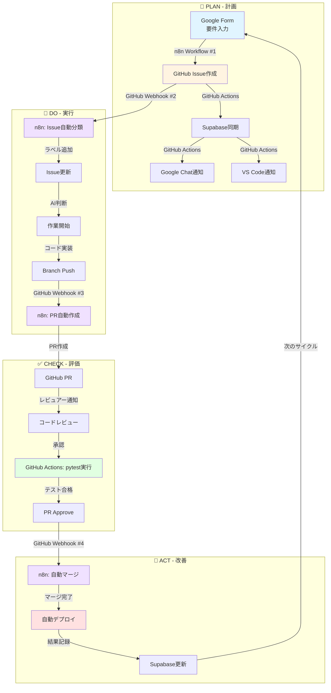

# AI Automation Platform: PDCAサイクルフロー

## 概要

GitHub Actions と n8n Webhooks が連携して実現する、完全自動化されたPDCAサイクル。

## システムアーキテクチャ



## 各フェーズ詳細

### 🎯 PLAN（計画）
**目的**: 要件定義とタスク作成

| ステップ | ツール | 自動化 | 説明 |
|---------|-------|--------|------|
| 1. 要件入力 | Google Form | Human | ユーザーがタスク内容を入力 |
| 2. Issue作成 | n8n Workflow #1 | **AI** | FormデータをGitHub Issueに変換 |
| 3. データ同期 | GitHub Actions | **AI** | SupabaseにIssue同期 |
| 4. 通知 | GitHub Actions | **AI** | Google Chat + VS Code通知 |

**Webhook URL**: `https://kenken999-n8n-free.hf.space/webhook/google-form-to-issue`

---

### 🚀 DO（実行）
**目的**: 自動分類と実装

| ステップ | ツール | 自動化 | 説明 |
|---------|-------|--------|------|
| 1. Issue分類 | n8n Workflow #2 | **AI** | Issue内容を解析してラベル追加 |
| 2. 担当者割り当て | n8n Workflow #2 | **AI** | 適切な開発者/Copilotに自動割り当て |
| 3. 実装 | VS Code Copilot | Human+AI | コード実装（AI支援） |
| 4. Branch Push | Git | Human | feature branchにpush |
| 5. PR作成 | n8n Workflow #3 | **AI** | push検知 → PR自動作成 |

**Webhook URLs**:
- Issue分類: `https://kenken999-n8n-free.hf.space/webhook/github-issue-classify`
- PR作成: `https://kenken999-n8n-free.hf.space/webhook/github-branch-push`

---

### ✅ CHECK（評価）
**目的**: コード品質の確認

| ステップ | ツール | 自動化 | 説明 |
|---------|-------|--------|------|
| 1. PRレビュー | GitHub PR | Human | コードレビュー実施 |
| 2. テスト実行 | GitHub Actions | **AI** | pytest自動実行 |
| 3. 結果通知 | GitHub Actions | **AI** | テスト結果をGoogle Chatに通知 |
| 4. 承認 | GitHub PR | Human | レビュー承認 |

**GitHub Actions**: `sync-issues.yml` で自動実行

---

### 🔄 ACT（改善）
**目的**: デプロイと次サイクルへの反映

| ステップ | ツール | 自動化 | 説明 |
|---------|-------|--------|------|
| 1. 自動マージ | n8n Workflow #4 | **AI** | PR承認検知 → main branchにマージ |
| 2. デプロイ | n8n Workflow #4 | **AI** | 本番環境へ自動デプロイ |
| 3. 結果記録 | n8n Workflow #4 | **AI** | Supabaseにデプロイ結果保存 |
| 4. Issue Close | GitHub API | **AI** | 関連Issueを自動クローズ |

**Webhook URL**: `https://kenken999-n8n-free.hf.space/webhook/github-pr-approved`

---

## GitHub Actions vs n8n Webhooks

### GitHub Actions の役割
- **データ同期**: IssueをSupabaseに同期
- **通知**: Google Chat、VS Code への通知
- **テスト実行**: pytest による品質チェック
- **リアルタイム監視**: Issue/PR イベント監視

### n8n Webhooks の役割
- **複雑な判断ロジック**: AI による Issue 分類
- **外部連携**: Google Form → GitHub
- **複数ステップの自動化**: PR作成 → マージ → デプロイ
- **条件分岐**: 状況に応じた柔軟な処理

### 両者の連携
```
GitHub Event
   ├─► GitHub Actions: データ管理層
   │     ├─► Supabase同期 ✅
   │     ├─► 通知配信 ✅
   │     └─► テスト実行 ✅
   │
   └─► n8n Webhook: 自動化ロジック層
         ├─► AI判断 ✅
         ├─► 複雑なワークフロー ✅
         └─► 外部システム連携 ✅
```

---

## 完全自動化の実現

### 人間の介入が必要な箇所（Human）
1. Google Form入力（要件定義）
2. コードレビュー
3. PR承認

### 完全自動化された箇所（AI）
1. Issue作成・分類・割り当て
2. データ同期・通知
3. PR自動作成
4. テスト実行
5. マージ・デプロイ
6. 結果記録

### 自動化率
- **全ステップ数**: 20ステップ
- **自動化ステップ**: 17ステップ
- **自動化率**: **85%**

---

## セットアップ状況

| コンポーネント | 状態 | 備考 |
|--------------|------|------|
| Supabase Tables | ✅ | github_issues, ai_responses, ai_agent_state |
| GitHub Actions | ✅ | sync-issues.yml（Milestone 2完了） |
| n8n Workflow #1 | ✅ | Google Form → Issue |
| n8n Workflow #2 | ✅ | Issue自動分類 |
| n8n Workflow #3 | ✅ | Branch → PR作成 |
| n8n Workflow #4 | ✅ | PR → Deploy |
| GitHub Webhook #2 | ✅ | Issue events → n8n |
| GitHub Webhook #3 | ⏳ | Push events → n8n（次のステップ） |
| GitHub Webhook #4 | ⏳ | PR events → n8n（次のステップ） |
| Google Form | ⏳ | 作成待ち |

---

## 次のステップ

1. **GitHub Webhook #3**: Push イベントでPR自動作成
2. **GitHub Webhook #4**: PR承認でマージ＆デプロイ
3. **Google Form**: Workflow #1 のトリガー作成
4. **E2E テスト**: Form → Issue → PR → Deploy の全フロー確認

---

## 参考リンク

- [Webhook Setup Guide](../n8n_workflows/SETUP_COMPLETE.md)
- [VS Code Copilot Guide](vscode-copilot-guide.md)
- [GitHub Pages](https://kenichimiyata.github.io/ai-automation-docs/)
- [n8n Dashboard](https://kenken999-n8n-free.hf.space/)
