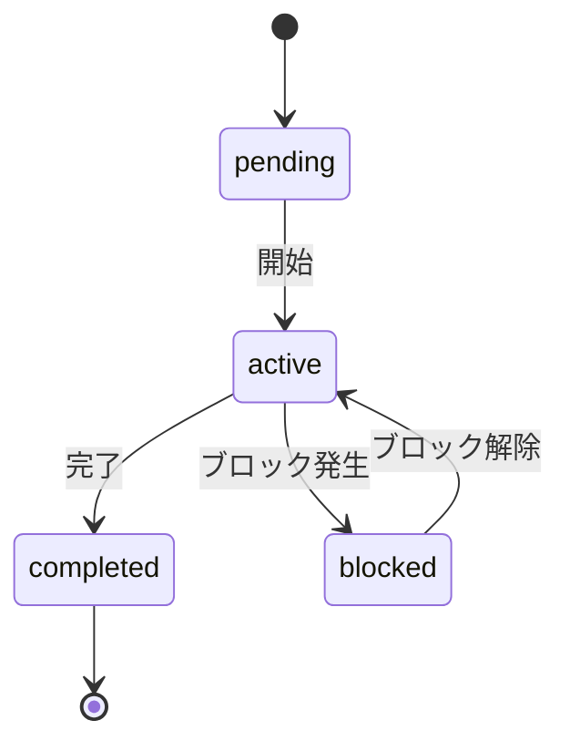

# ワークフロー設計思想 - Supabase駆動BPMNアーキテクチャ

> **"専用ツール不要。Supabase + HTML5 でBPMNと同等のワークフロー管理を実現する"**

## なぜこの設計か

| 従来のアプローチ | このアプローチ |
|----------------|--------------|
| Camunda（Java/重い） | Supabase（軽量・既存） |
| 専用BPMNエンジン | HTMLページ + REST API |
| 別途インフラ構築 | 今すぐ使える |
| 学習コスト高 | 標準Web技術のみ |

---

## アーキテクチャ

```
┌─────────────────────────────────────────────┐
│          HTML5 ワークフロー画面              │
│                                             │
│  [要件定義 ✅] → [設計 🔄] → [実装 ⏸]      │
│                    ↑今ここ                  │
│  [✅ 完了] [⏭ 次へ] [🔁 差し戻し]          │
│                                             │
│  ← このURLを共有するだけで全員が同じ状態を見られる →   │
└──────────────┬──────────────────────────────┘
               │ REST API (PostgREST)
               ↓
┌─────────────────────────────────────────────┐
│         Supabase (状態管理)                  │
│  workflow_processes  ← プロセス定義          │
│  workflow_steps      ← ステップ定義          │
│  workflow_state      ← 実行中の状態          │
└──────────────┬──────────────────────────────┘
               │ Realtime（websocket）
               ↓
┌─────────────────────────────────────────────┐
│  AIエージェント（Copilot / Claude / Gemini）│
│  → Supabaseの状態を読んで今何をすべきか把握  │
│  → 作業完了後にstatus更新                   │
└─────────────────────────────────────────────┘
```

---

## データモデル

### `workflow_processes` - プロセス定義

```sql
CREATE TABLE workflow_processes (
  id          uuid PRIMARY KEY DEFAULT gen_random_uuid(),
  name        text NOT NULL,           -- 例: "機能開発フロー"
  description text,
  mermaid_def text,                    -- Mermaid図定義（可視化用）
  created_at  timestamptz DEFAULT now()
);
```

### `workflow_steps` - ステップ定義

```sql
CREATE TABLE workflow_steps (
  id           uuid PRIMARY KEY DEFAULT gen_random_uuid(),
  process_id   uuid REFERENCES workflow_processes(id),
  step_order   int NOT NULL,
  name         text NOT NULL,          -- 例: "要件定義"
  description  text,
  assignee     text                    -- "human" | "ai" | "both"
);
```

### `workflow_state` - 実行中の状態（これがBPMNエンジンの代替）

```sql
CREATE TABLE workflow_state (
  id           uuid PRIMARY KEY DEFAULT gen_random_uuid(),
  process_id   uuid REFERENCES workflow_processes(id),
  current_step uuid REFERENCES workflow_steps(id),
  status       text DEFAULT 'pending', -- pending | active | completed | blocked
  context      jsonb,                  -- AI向けコンテキスト情報
  memo         text,                   -- 人間/AIからのコメント
  updated_at   timestamptz DEFAULT now()
);
```

---

## ステップの状態遷移（BPMN Token と同等）



| status | 意味 | 誰が操作 |
|--------|------|---------|
| `pending` | 未開始 | - |
| `active` | 作業中（今ここ） | 人間 or AI |
| `completed` | 完了 | 人間 or AI |
| `blocked` | ブロック中 | 人間が記録 |

---

## Camundaとの機能対応表

| BPMN / Camunda 概念 | このアーキテクチャ |
|--------------------|-----------------|
| プロセス定義 | `workflow_processes` テーブル |
| ユーザータスク | `assignee = 'human'` のステップ |
| サービスタスク | `assignee = 'ai'` のステップ |
| トークン（実行位置） | `workflow_state.current_step` |
| プロセスエンジン | Supabase PostgREST |
| タスク画面 | HTML5ページ（URLで共有） |
| 承認待ち | `status = 'blocked'` |
| 完了通知 | Supabase Realtime |

---

## HTML5ワークフロー画面の仕様

### 表示要素

1. **Mermaid図** - フロー全体を可視化、現在ステップをハイライト
2. **ステップリスト** - 各ステップのステータスをバッジ表示
3. **操作ボタン** - 「完了にする」「次へ」「ブロック」「差し戻し」
4. **AIコンテキスト欄** - AI向けメモを記録（次のAIセッションに引き継ぐ）

### URL設計

```
/workflow.html?process_id=xxx-yyy-zzz
```

- このURLをチャットやSlackに貼るだけで現在の状態を共有
- GitHub Copilotもこのページを参照して「今何をすべきか」を把握

---

## AIセッション引き継ぎプロトコル

新しいAIセッション開始時の手順：

```
1. AIが workflow_state テーブルを読む
2. status = 'active' のレコードを確認
3. context / memo を読んで前回の状態を把握
4. 「前回は○○の途中でした。続けますか？」と確認
5. 作業完了後に status を 'completed' に更新
6. 次ステップを 'active' に変更
7. memo に今日の作業サマリーを記録
```

---

## このアーキテクチャのメリット

- ✅ **ゼロ依存** - 追加サーバー・ツール不要
- ✅ **AIフレンドリー** - JSONベースでAIが読み書きできる
- ✅ **URL共有** - ブラウザだけで誰でもアクセス可能
- ✅ **Realtime対応** - 複数人・複数AIが同時に状態参照
- ✅ **BPMN互換** - 将来的にCamundaへ移行可能な設計
- ✅ **Mermaid可視化** - GitHubのREADMEでもそのまま表示

---

## 関連リンク

- [GitHub Project Roadmap](https://github.com/users/kenichimiyata/projects/6)
- [System Architecture](./System-Architecture.md)
- [Tech Stack](https://kenichimiyata.github.io/ai-automation-docs/docs/wiki/tech-stack-architecture)
