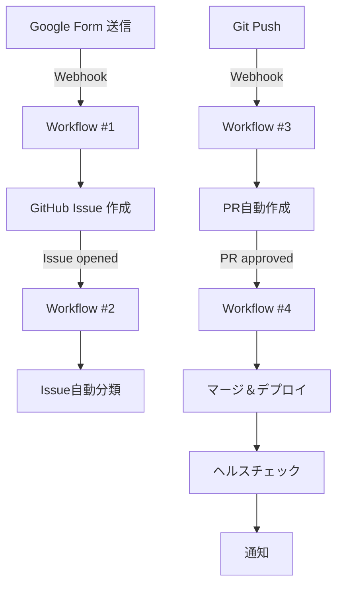

# 🎉 n8n ワークフロー セットアップ完了

**完了日時:** 2026-03-02  
**ステータス:** 全4ワークフロー Active ✅

---

## 📋 登録済みワークフロー

| # | ワークフロー名 | ステータス | ノード数 | Workflow ID |
|---|--------------|----------|---------|-------------|
| 1 | Google Form → GitHub Issue | ✅ Active | 5 | `Smhynt7Gvp2Cfpu2` |
| 2 | Issue自動分類 | ✅ Active | 9 | `IRousr79doQJhyC5` |
| 3 | PR自動作成 | ✅ Active | 8 | `Luv7ZgygpznLnOrE` |
| 4 | マージ＆デプロイ | ✅ Active | 12 | `Bbpmel4jLa8oeDCo` |

---

## 🔗 Webhook URL一覧

### Workflow #1: Google Form → GitHub Issue
```
https://kenken999-n8n-free.hf.space/webhook/google-form-to-issue
```
- **トリガー**: Google Form 送信
- **イベント**: POST リクエスト
- **必須フィールド**: `title`, `description`, `priority`, `category`

### Workflow #2: Issue自動分類
```
https://kenken999-n8n-free.hf.space/webhook/github-issue-classify
```
- **トリガー**: GitHub Issues (opened)
- **処理**: キーワード検出、ラベル付与、担当者割当

### Workflow #3: PR自動作成
```
https://kenken999-n8n-free.hf.space/webhook/github-branch-push
```
- **トリガー**: GitHub Push event
- **処理**: feature/bugfix/docs ブランチ検出、PR自動作成

### Workflow #4: マージ＆デプロイ
```
https://kenken999-n8n-free.hf.space/webhook/github-pr-approved
```
- **トリガー**: GitHub Pull Request Review (approved)
- **処理**: PRマージ → デプロイ → ヘルスチェック → 通知

---

## ⚙️ 次のステップ

### 1. GitHub Webhook 設定

**リポジトリ**: `kenichimiyata/ai-automation-dashboard`

#### Webhook #1: Issue自動分類 (Workflow #2)
```
Settings → Webhooks → Add webhook

Payload URL: https://kenken999-n8n-free.hf.space/webhook/github-issue-classify
Content type: application/json
Events: Issues (opened, edited)
Active: ✅
```

#### Webhook #2: PR自動作成 (Workflow #3)
```
Payload URL: https://kenken999-n8n-free.hf.space/webhook/github-branch-push
Content type: application/json
Events: Push
Active: ✅
```

#### Webhook #3: マージ＆デプロイ (Workflow #4)
```
Payload URL: https://kenken999-n8n-free.hf.space/webhook/github-pr-approved
Content type: application/json
Events: Pull request reviews (approved, submitted)
Active: ✅
```

---

### 2. Google Form 作成

#### フォーム設定
```
タイトル: AI Automation Platform - 要件定義フォーム
説明: システム開発の要件を入力してください。自動的にGitHub Issueが作成されます。
```

#### 質問項目
| 質問 | タイプ | 必須 | 選択肢 |
|------|--------|------|--------|
| タイトル | 短い回答 | ✅ | - |
| 詳細説明 | 段落 | ✅ | - |
| 優先度 | プルダウン | ✅ | high / medium / low |
| カテゴリ | プルダウン | ✅ | feature / bug / enhancement / docs |
| 要求者 | 短い回答 | | - |

#### スクリプト設定
```javascript
// Google Apps Script で設定
function onFormSubmit(e) {
  const formData = {
    title: e.values[1],
    description: e.values[2],
    priority: e.values[3],
    category: e.values[4],
    requester: e.values[5] || 'Anonymous'
  };
  
  const options = {
    method: 'post',
    contentType: 'application/json',
    payload: JSON.stringify(formData)
  };
  
  UrlFetchApp.fetch(
    'https://kenken999-n8n-free.hf.space/webhook/google-form-to-issue',
    options
  );
}

// トリガー設定: フォーム送信時
```

---

### 3. テスト実施 (推奨順序)

#### Step 1: Google Form テスト
```bash
# Formから送信 → GitHub Issue作成確認
1. Google Form から要件入力
2. GitHub Issue が自動作成されることを確認
3. Google Chat に通知が届くことを確認
```

#### Step 2: Issue自動分類テスト
```bash
# GitHub で Issue 作成 → 自動分類確認
1. GitHub で新規 Issue 作成（タイトルに「緊急」「バグ」等含む）
2. ラベルが自動付与されることを確認
3. 担当者が自動割り当てされることを確認
```

#### Step 3: PR自動作成テスト
```bash
# feature ブランチ作成 → PR自動作成確認
git checkout -b feature/issue-1/test-auto-pr
git commit --allow-empty -m "Test: PR自動作成"
git push origin feature/issue-1/test-auto-pr

# 確認事項:
# - PR が自動作成される
# - Issue #1 がリンクされる
# - レビュアーが自動割り当てされる
```

#### Step 4: マージ＆デプロイテスト
```bash
# PRを承認 → デプロイ＆ヘルスチェック確認
1. GitHub で PR を Approve
2. 自動マージされることを確認
3. デプロイが実行されることを確認
4. ヘルスチェック結果が通知されることを確認
```

---

## 🔧 トラブルシューティング

### Workflow #4 の警告マーク
- **原因**: 環境変数未設定 or Credential不足
- **対処**:
  ```bash
  # n8n UI で設定確認
  1. Workflow #4 を開く
  2. 各ノードの赤いエラーマークを確認
  3. GitHub Token, Google Chat Webhook を設定
  ```

### Webhook が反応しない
```bash
# n8n Executions で確認
1. n8n UI → Executions タブ
2. エラーログを確認
3. Webhook URL が正しいか再確認
```

### GitHub Webhook エラー
```bash
# GitHub Settings → Webhooks で確認
1. Recent Deliveries を確認
2. Response body でエラー内容を確認
3. Redeliver でリトライ
```

---

## 📊 実行統計 (n8n Dashboard)

```
Prod. executions: 117 (↑1,362.5%)
Failed executions: 19 (↑375%)
Failure rate: 16.2%
Run time (avg.): 2.03s
```

---

## 🚀 完成したワークフロー



---

## 📝 関連ファイル

- `workflow-1-form-to-issue.json` - Google Form → GitHub Issue  
- `workflow-2-classify-issue.json` - Issue自動分類  
- `workflow-3-auto-create-pr.json` - PR自動作成  
- `workflow-4-merge-and-deploy.json` - マージ＆デプロイ  
- `webhook_urls.json` - Webhook URL一覧  
- `activate_all_workflows.py` - 全ワークフロー有効化スクリプト  

---

## ✅ 完了チェックリスト

- [x] BPMNワークフロー定義 (ai-automation-workflow.bpmn)
- [x] Supabase に保存 (ID: 9)
- [x] BPMN Designer で表示確認
- [x] 4つの n8n ワークフロー作成
- [x] n8n API経由でアップロード
- [x] 全ワークフロー有効化 (Active)
- [x] Webhook URL 取得
- [ ] GitHub Webhook 設定
- [ ] Google Form 作成＆連携
- [ ] E2E テスト実施

---

**次のアクション**: GitHub Webhook を設定して、実際の自動化フローをテストする 🚀
